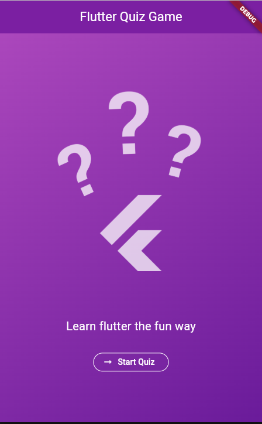
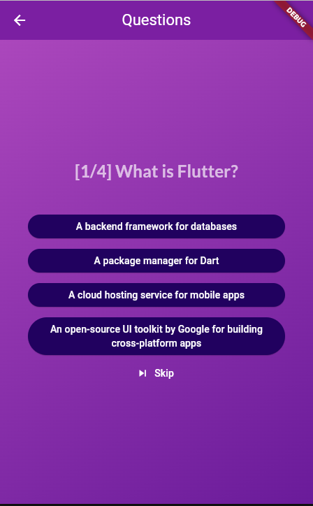
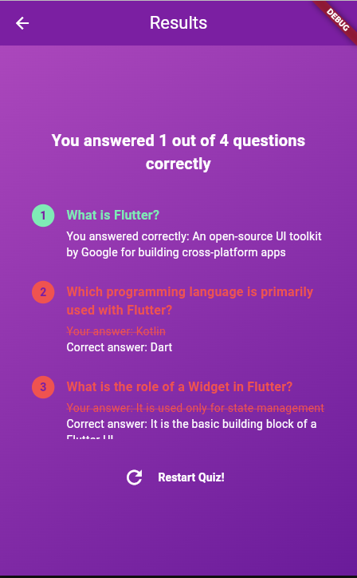

# Quiz App

**Team Member:** Doan Duy Thai

## Project Summary
Quiz is a simple application that guides users through a series of questions and then shows their results.

## Description
This app may seem simple—users answer a few questions (e.g., 4), and correct answers are highlighted in green. However, the true value of this project lies not just in what the app does, but **how** it’s built. It demonstrates proper use of core Flutter development practices, from **file structure** and **naming conventions** to integrating powerful tools like the **Hive database** for local storage and **GoRouter** for navigation.

The project serves as a **standardized, reference application** that showcases:
- How to organize a Flutter project effectively (folders, files, packages).
- How to implement adapters for data handling.
- How to create a clean, scalable structure for future projects.

Though simple in functionality, this app will serve as a **go-to reference** for future Flutter development.

## Screenshots

